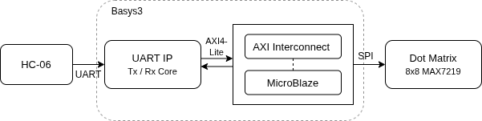

# Custom UART IP — SoC Integration on Basys3 FPGA

> Verilog로 설계한 커스텀 UART IP를 MicroBlaze SoC에 통합하고, 블루투스로 수신한 문자를 Dot Matrix에 실시간 표시하는 시스템

---

## 1. 개요 (Overview)

| 항목 | 내용 |
|------|------|
| 플랫폼 | Basys3 (Xilinx Artix-7 FPGA) |
| 언어 | Verilog, C |
| 도구 | Vivado, Vitis, VsCode |
| 통신 | UART (9600 bps), AXI4-Lite, SPI |
| 개발 기간 | 2025.04.13-21 |
| 팀 구성 | 3인 팀 프로젝트 |

---

## 2. 담당 역할 (My Role)

- UART RX Core RTL 설계 — 중앙 샘플링, false start 무시, 프레임 오류 감지 구현
- RX 테스트벤치 정상 / 오류 케이스 분리 설계 및 시뮬레이션 검증
- Vitis 펌웨어 — 문자 분류 로직, Char Pattern 배열 정의, MAX7219 SPI 드라이버 구현

---

## 3. 주요 기능 (Key Features)

- **UART IP 설계** — Verilog 기반 TX/RX Core를 AXI4-Lite Slave로 패키징해 MicroBlaze SoC에 통합
- **블루투스 수신** — HC-06으로 스마트폰에서 전송한 문자를 UART로 수신
- **Dot Matrix 출력** — 수신 문자(0~9, A~Z, a~z)를 8×8 패턴으로 변환해 MAX7219 SPI로 출력

---

## 4. 기술 스택 및 아키텍처 (Tech Stack & Architecture)

---

## 5. 핵심 구현 및 트러블슈팅 (Key Implementation & Troubleshooting)

### 핵심 구현

**① RX Core — 중앙 샘플링 및 프레임 오류 감지**
Start bit 감지 후 Baud 주기 절반 지점에서 rx를 재확인하여 false start noise를 무시하고, Stop bit가 High가 아닐 경우 `rx_error` 플래그를 출력하는 로직을 구현했다.

**② Vitis 펌웨어 — 문자 분류 및 Dot Matrix 출력**
수신된 ASCII 코드를 숫자 / 대문자 / 소문자 3가지로 분기하여 Char Pattern 배열을 O(1)로 인덱싱 후 MAX7219에 행 단위 SPI 전송한다.

**③ RX 시뮬레이션 — 테스트벤치 분리 설계**
정상 수신(Normal receive, Back-to-back)과 오류 처리(Frame error, False start) 케이스를 독립된 테스트벤치로 분리하여 케이스 간 상태 간섭 없이 각각 검증했다.

### 트러블슈팅

| 발생 문제 | 발생 원인 | 해결 방안 | 결과 |
|-----------|-----------|-----------|------|
| RX 시뮬레이션에서 정상·오류 케이스 결과 혼재 | 오류 케이스 후 스테이트 머신이 IDLE 복귀 전 다음 케이스 시작 | 테스트벤치를 정상(`tb_rx_normal.v`) / 오류(`tb_rx_error.v`)로 분리 | 4가지 조건 독립 검증 완료 |
| Dot Matrix 일부 LED 미점등 및 밝기 불균일 | Basys3 GPIO(3.3V)가 MAX7219 신호 요구 레벨(3.5V+) 미달 | MC74HCT245 레벨 시프터 추가 | 전체 LED 정상 점등 확인 |
| 62가지 문자 패턴 수작업 정의로 작업 시간 과다 | 자동화 도구 없이 8×8 픽셀을 비트 단위로 직접 설계 | 그리드 스케치 → 이진수 → 16진수 변환 워크플로 정립 | 전체 문자 패턴 체계적 정의 완료 |

---

## 6. 디렉토리 구조 (Directory Structure)

| 파일 / 경로 | 역할 |
|------|------|
| `SoC/ip_repo/myip_rxtx_1_0/` | UART TX/RX Core + AXI Slave 커스텀 IP |
| `SoC/ip_repo/myip_uart_1_0/` | UART IP 패키징 최상위 모듈 |
| `SoC/ip_repo/rx.v` | RX Core — 중앙 샘플링, 프레임 오류 감지 |
| `SoC/ip_repo/tx.v` | TX Core — 병렬→직렬 송신 스테이트 머신 |
| `SoC/ip_repo/rx_tb.v` | RX 테스트벤치 |
| `SoC/project_rxtx/` | Vivado 프로젝트 — Block Design, 소스, 제약 파일 |
| `Vitis/dot/src/` | Vitis 펌웨어 소스 — 문자 분류, SPI 드라이버 |
| `Vitis/dot_matrix/microblaze_riscv_0/` | MicroBlaze 보드 지원 패키지 |
